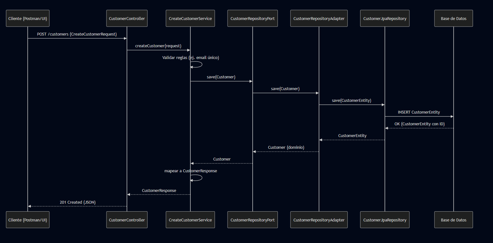
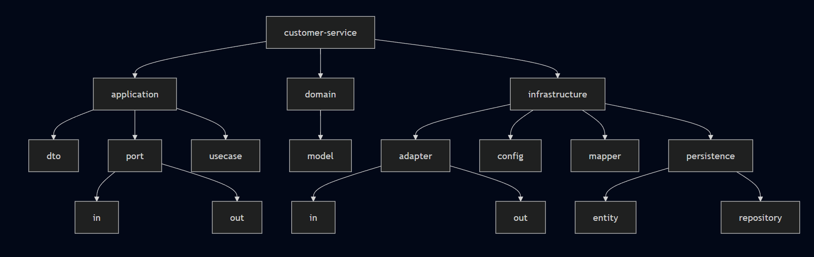

# 📦 Customer Service

Microservicio responsable de la **gestión de clientes** dentro de la plataforma **MicroERP**.  
Implementa arquitectura **hexagonal (Ports & Adapters)** con **Spring Boot**.

---

## 🎯 Objetivo
Permitir la administración de clientes del negocio, incluyendo:
- Registro de clientes con datos básicos.
- Consulta, actualización parcial y eliminación.
- Exposición de métricas (Actuator + Prometheus).
- Integración futura con otros servicios (ej. **Sales Service** para asociar clientes a ventas).

---

## 🏗️ Arquitectura

El servicio sigue **arquitectura hexagonal**, separando la lógica de negocio de la infraestructura:

### 1. **Domain**
- `model/` → Entidad de negocio (`Customer`).
- Sin dependencias externas (ni JPA, ni frameworks).

### 2. **Application**
- `dto/` → Objetos de transferencia (`CreateCustomerRequest`, `UpdateCustomerRequest`, `CustomerResponse`).
- `port/`
  - `in/` → Interfaces de casos de uso (`CreateCustomerUseCase`, `UpdateCustomerUseCase`, `GetCustomerUseCase`, `DeleteCustomerUseCase`).
  - `out/` → Interfaces hacia infraestructura (`CustomerRepositoryPort`).
- `usecase/` → Casos de uso del negocio (`CreateCustomerService`, `UpdateCustomerService`, etc.).

### 3. **Infrastructure**
- `adapter/`
  - `in/` → Controlador REST (`CustomerController`).
  - `out/` → Adaptadores de persistencia (repositorios JPA).
- `persistence/`
  - `entity/` → Entidad JPA (`CustomerEntity`).
  - `repository/` → Interface JPA (`CustomerJpaRepository`).
- `mapper/` → Conversión entre dominio, DTOs y entidades JPA.
- `config/` → Configuración de Spring, Swagger, seguridad, etc.

---

## 🔄 Flujo típico

1. Una petición llega al **CustomerController**.
2. El controlador invoca un **caso de uso** (ej: `CreateCustomerService`).
3. El caso de uso valida reglas de negocio (ej: email único) y mapea el request a un objeto de dominio (`Customer`).
4. Se utiliza el puerto de salida `CustomerRepositoryPort` para persistir.
5. El adaptador de persistencia (`CustomerRepositoryAdapter`) convierte el modelo de dominio a entidad JPA y lo guarda.
6. El resultado vuelve al caso de uso → mapper → DTO de respuesta → API REST.  



---

## 🚀 Endpoints principales

Todos los endpoints expuestos están documentados con **Swagger/OpenAPI** en:  
`http://localhost:{puerto}/swagger-ui.html`

| Método | Endpoint            | Descripción                  |
|--------|---------------------|------------------------------|
| POST   | `/customers`        | Crear cliente                |
| GET    | `/customers`        | Listar todos los clientes    |
| GET    | `/customers/{id}`   | Obtener cliente por ID       |
| PUT    | `/customers/{id}`   | Actualizar cliente (parcial) |
| DELETE | `/customers/{id}`   | Eliminar cliente             |

---

## 📊 Observabilidad

- **Spring Boot Actuator** habilitado → `/actuator/*`.
- Métricas disponibles para **Prometheus** en `/actuator/prometheus`.

---

## 🧪 Testing

- **Unit Tests** con **JUnit 5** y **Mockito**.  
  - Casos de uso probados con repositorios mockeados.  
- Cobertura:
  - `CreateCustomerServiceTest` valida creación y error por email duplicado.  
  - `UpdateCustomerServiceTest` valida actualización parcial y error por ID inexistente.  
  - `GetCustomerServiceTest` valida búsqueda por ID y listado.  
  - `DeleteCustomerServiceTest` valida borrado y error por ID inexistente.  

---

## ⚙️ Tecnologías

- **Backend:** Java 21, Spring Boot 3.3.x  
- **Persistencia:** Spring Data JPA + MySQL  
- **Seguridad:** Keycloak (JWT via API Gateway)  
- **Testing:** JUnit 5, Mockito  
- **Observabilidad:** Actuator, Prometheus  
- **Documentación:** Swagger / OpenAPI  

---

## 📂 Estructura del proyecto

```
customer-service
 ├── application
 │   ├── dto
 │   ├── port
 │   │   ├── in
 │   │   └── out
 │   └── usecase
 ├── domain
 │   └── model
 └── infrastructure
     ├── adapter
     │   ├── in
     │   └── out
     ├── config
     ├── mapper
     └── persistence
         ├── entity
         ├── repository
```


---

## ✅ Beneficios de este diseño

- Separación clara entre negocio y frameworks.  
- Facilita testing con mocks en los puertos.  
- Flexibilidad para cambiar la capa de persistencia.  
- Documentación automática con Swagger.  
- Observabilidad lista para Prometheus/Grafana.  
