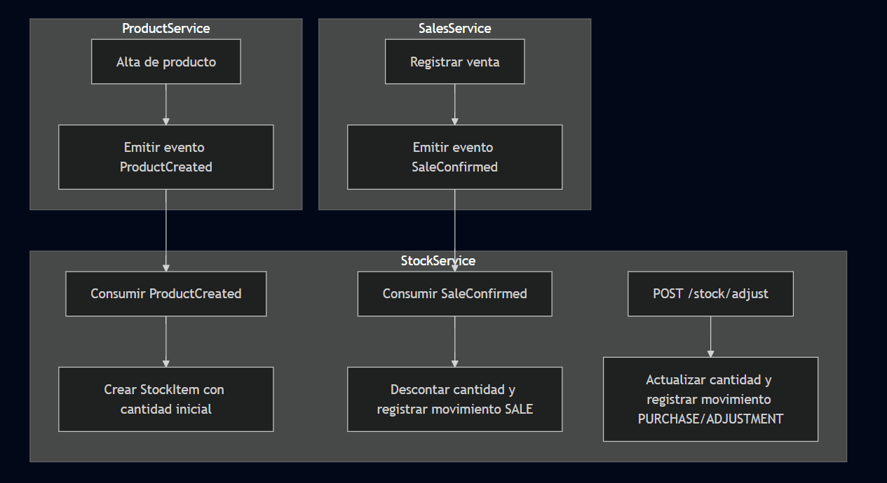

# 📘 Modelo de Negocio – Stock Service (MicroERP)

## 🎯 Objetivo
Definir la política de negocio para la gestión de inventario en el **Stock Service**, describiendo cómo se relaciona con los productos y cómo se actualiza ante eventos de negocio como registros y ventas.

---

## 🔹 Política de Negocio

- **Dueño del stock**:  
  El **Stock Service** es el único responsable de mantener la cantidad disponible de cada producto.

- **Productos y Stock**:  
  - El `ProductService` gestiona catálogo (nombre, categoría, precio, descripción).  
  - El `StockService` gestiona inventario (cantidad disponible, ajustes, reservas, movimientos).

- **Reglas básicas**:  
  1. Al registrar un producto, se puede indicar **stock inicial**.  
  2. Si no se especifica, el stock se inicializa en **0**.  
  3. Solo el **Stock Service** puede modificar cantidades.  
  4. El stock se ajusta automáticamente en base a eventos de ventas, y manualmente mediante endpoints administrativos.

---

## 🔹 Escenario de Registro de Producto

1. **Alta de producto** desde el `ProductService`.  
   - El DTO `ProductRequest` incluye un campo opcional `initialQuantity`.  

2. **Evento emitido** por `ProductService`:  
   ```json
   {
     "eventType": "ProductCreated",
     "data": {
       "productId": 101,
       "sku": "SKU-101",
       "name": "Laptop Gamer",
       "categoryId": 5,
       "initialQuantity": 20
     }
   }
   ```

3. **Stock Service consume** el evento:  
   - Crea un registro `StockItem` asociado a `productId`.  
   - Inicializa la cantidad según `initialQuantity` o `0` si no viene informado.

---

## 🔹 Escenario de Venta

1. **Flujo de venta**:  
   - Cliente realiza una compra.  
   - `SalesService` registra la venta en su BD.  
   - Publica evento `SaleConfirmed` en el broker.  

2. **Evento `SaleConfirmed`:**
   ```json
   {
     "eventType": "SaleConfirmed",
     "data": {
       "saleId": 501,
       "productId": 101,
       "quantity": 2
     }
   }
   ```

3. **Stock Service consume** el evento:  
   - Busca el `StockItem` por `productId`.  
   - Descuenta la cantidad vendida.  
   - Registra un movimiento de tipo `SALE`.  

---

## 🔹 Escenario de Ajuste Manual

- Endpoint: `POST /stock/adjust`  
- Request:
  ```json
  {
    "productId": 101,
    "quantity": 50,
    "reason": "Compra a proveedor"
  }
  ```
- Acción:  
  - Stock aumenta la cantidad.  
  - Registra movimiento de tipo `PURCHASE`.

---

## 🔹 Entidades Clave

- **StockItem**
  - `id`
  - `productId`
  - `quantity`
  - `status` (ACTIVE/INACTIVE)

- **StockMovement**
  - `id`
  - `productId`
  - `quantity`
  - `type` (SALE, PURCHASE, ADJUSTMENT)
  - `date`
  - `reason`

---

## ✅ Beneficios del Modelo

- Catálogo y stock separados, pero sincronizados por eventos.  
- Flexibilidad para crear productos con o sin stock inicial.  
- Trazabilidad de inventario mediante `StockMovement`.  
- Desacoplamiento entre Product, Stock y Sales.  
- Preparado para escalar con reservas, devoluciones y multidepósito en el futuro.

---

## 🔹 Diagrama de Flujo



