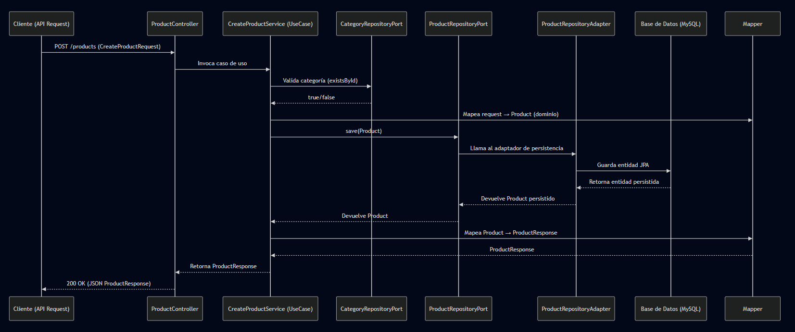
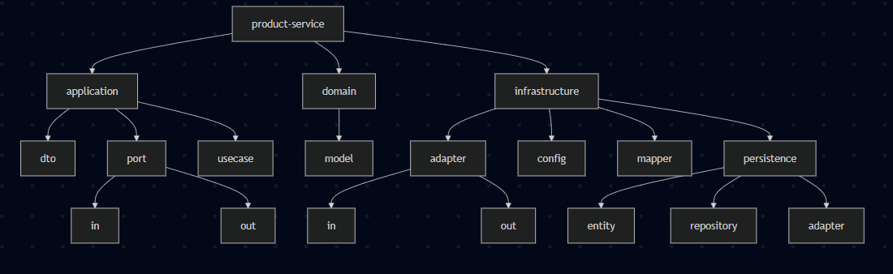

# 📦 Product Service

Microservicio responsable de la **gestión de productos** dentro de la plataforma **MicroERP**.  
Implementa arquitectura **hexagonal (Ports & Adapters)** con **Spring Boot** y se integra con otros microservicios vía **RabbitMQ (event-driven)**.

---

## 🎯 Objetivo
Permitir la administración de productos del negocio, incluyendo:
- Registro de productos con categoría.
- Consulta, actualización y eliminación.
- Exposición de métricas (Actuator + Prometheus).
- 📢 **Publicación de eventos a RabbitMQ** para sincronización con el **Stock Service**:
    - `product.created` → Inicializa stock del producto.
    - `product.deleted` → Elimina stock asociado al producto.

---

## 🏗️ Arquitectura

El servicio sigue **arquitectura hexagonal**, separando la lógica de negocio de la infraestructura:

### 1. **Domain**
- `model/` → Entidades de negocio (`Product`, `Category`).
- Sin dependencias externas (ni JPA, ni frameworks).

### 2. **Application**
- `dto/` → Objetos de transferencia (`CreateProductRequest`, `ProductResponse`, `CategoryResponse`, `ProductCreatedEvent`, `ProductDeletedEvent`).
- `port/`
    - `in/` → Interfaces de casos de uso (`CreateProductUseCase`, `GetProductUseCase`, `DeleteProductUseCase`, etc.).
    - `out/` → Interfaces hacia infraestructura (`ProductRepositoryPort`, `CategoryRepositoryPort`).
- `usecase/` → Casos de uso del negocio (`CreateProductService`, `GetProductService`, `DeleteProductService`, etc.).
- `event/` → Publicadores de eventos (`ProductEventPublisher`).

### 3. **Infrastructure**
- `adapter/`
    - `in/` → Controladores REST (`ProductController`).
    - `out/` → Adaptadores de persistencia (repositorios JPA) y eventos (RabbitMQ).
- `persistence/`
    - `entity/` → Entidades JPA (`ProductEntity`, `CategoryEntity`).
    - `repository/` → Interfaces JPA (`ProductJpaRepository`, `CategoryJpaRepository`).
- `mapper/` → Conversión entre entidades de dominio, DTOs y JPA.
- `config/` → Configuración de Spring, Swagger, RabbitMQ, etc.

---

## 🔄 Flujo típico

1. Una petición llega al **ProductController**.
2. El controlador invoca un **caso de uso** (ej: `CreateProductService`).
3. El caso de uso valida la categoría y mapea el request a un objeto de dominio (`Product`).
4. Se utiliza el puerto de salida `ProductRepositoryPort` para persistir.
5. El adaptador de persistencia (`ProductRepositoryAdapter`) convierte el modelo de dominio a entidad JPA y lo guarda.
6. Se publica un **evento a RabbitMQ** (`product.created` o `product.deleted`).
7. El **Stock Service** consume ese evento y sincroniza su inventario.
8. El resultado vuelve al caso de uso → mapper → DTO de respuesta → API REST.



---

## 🚀 Endpoints principales

Todos los endpoints expuestos están documentados con **Swagger/OpenAPI** en:  
`http://localhost:{puerto}/swagger-ui.html`

| Método | Endpoint          | Descripción                 |
|--------|-------------------|-----------------------------|
| POST   | `/products`       | Crear producto (publica `product.created`) |
| GET    | `/products`       | Listar todos los productos  |
| GET    | `/products/{id}`  | Obtener producto por ID     |
| PUT    | `/products/{id}`  | Actualizar producto         |
| DELETE | `/products/{id}`  | Eliminar producto (publica `product.deleted`) |
| POST   | `/categories`     | Crear categoría             |
| GET    | `/categories`     | Listar todas las categorías |
| GET    | `/categories/{id}`| Obtener categoría por ID    |
| PUT    | `/categories/{id}`| Actualizar categoría        |
| DELETE | `/categories/{id}`| Eliminar categoría          |

---

## 📊 Observabilidad

- **Spring Boot Actuator** habilitado → `/actuator/*`.
- Métricas disponibles para **Prometheus** en `/actuator/prometheus`.

---

## 🧪 Testing

- **Unit Tests** con **JUnit 5** y **Mockito**.
    - Casos de uso probados con puertos mockeados.
    - Ejemplos:
        - `CreateProductServiceTest` valida creación correcta, error cuando la categoría no existe y publicación de eventos.
        - `DeleteProductServiceTest` valida eliminación correcta, error cuando el producto no existe, restricción de integridad y publicación de evento.

---

## ⚙️ Tecnologías

- **Backend:** Java 21, Spring Boot 3.3.x
- **Persistencia:** Spring Data JPA + MySQL
- **Mensajería:** RabbitMQ (Spring AMQP)
- **Seguridad:** Keycloak (JWT via API Gateway)
- **Testing:** JUnit 5, Mockito
- **Observabilidad:** Actuator, Prometheus
- **Documentación:** Swagger / OpenAPI

---

## 📂 Estructura del proyecto

```
product-service
 ├── application
 │   ├── dto
 │   ├── event
 │   ├── port
 │   │   ├── in
 │   │   └── out
 │   └── usecase
 ├── domain
 │   └── model
 └── infrastructure
     ├── adapter
     │   ├── in
     │   └── out
     ├── config
     ├── mapper
     └── persistence
         ├── entity
         ├── repository
         └── adapter
```


---

## ✅ Beneficios de este diseño

- Desacoplamiento entre dominio y frameworks.
- Facilidad de testear con mocks.
- Integración event-driven con otros microservicios.
- Flexibilidad para cambiar infraestructura (ej: reemplazar JPA por MongoDB).
- Documentación automática de APIs.
- Observabilidad lista para producción.

---
