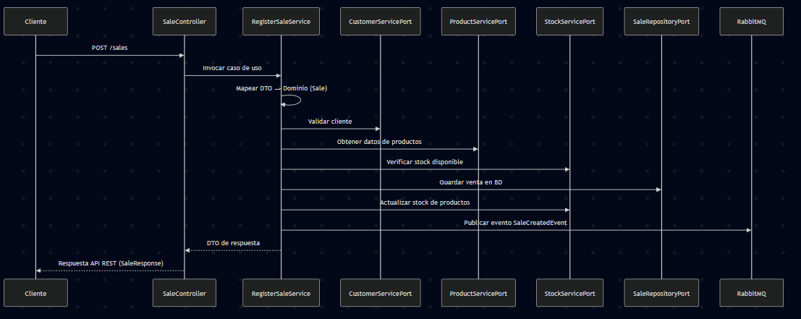

# 🛒 Sales Service

Microservicio responsable de la **gestión de ventas** dentro de la plataforma **MicroERP**.  
Implementa arquitectura **hexagonal (Ports & Adapters)** con **Spring Boot**.

---

## 🎯 Objetivo
Permitir la administración de ventas del negocio, incluyendo:
- Registro de ventas validadas con clientes, productos y stock.  
- Consulta de ventas por estado, cliente, rango de fechas o ID.  
- Cancelación de ventas existentes.  
- Publicación de eventos de ventas confirmadas para otros microservicios.  

---

## 🏗️ Arquitectura

El servicio sigue **arquitectura hexagonal**, separando la lógica de negocio de la infraestructura:

### 1. **Domain**
- `model/` → Entidades de negocio (`Sale`, `SaleItem`, `SaleStatus`).  
- Sin dependencias externas.

### 2. **Application**
- `dto/` → Objetos de transferencia (`CreateSaleRequest`, `SaleResponse`, `SaleItemRequest`, `SaleItemResponse`, `SaleCreatedEvent`, `SaleItemEvent`).  
- `port/`
  - `in/` → Interfaces de casos de uso (`CreateSaleUseCase`, `ListSalesUseCase`, `GetSaleByIdUseCase`, `CancelSaleUseCase`, etc.).  
  - `out/` → Interfaces hacia infraestructura (`SaleRepositoryPort`, `ProductServicePort`, `CustomerServicePort`, `StockServicePort`).  
- `usecase/` → Casos de uso del negocio (`RegisterSaleService`, `ListSalesService`, `ListSalesByCustomerService`, `ListSalesByDateRangeService`, `CancelSaleService`, etc.).  

### 3. **Infrastructure**
- `adapter/`
  - `in/` → Controlador REST (`SaleController`).  
  - `out/` → Adaptadores de persistencia (repositorios JPA) y servicios externos (Customer, Product, Stock).  
- `persistence/`
  - `entity/` → Entidades JPA (`SaleEntity`, `SaleItemEntity`).  
  - `repository/` → Interfaces JPA (`SaleJpaRepository`).  
- `mapper/` → Conversión entre dominio y DTOs (`SaleDtoMapper`).  
- `config/` → Configuración de Spring, RabbitMQ, Swagger, logs.  

---

## 🔄 Flujo típico

1. Una petición llega al **SaleController**.  
2. El controlador invoca un **caso de uso** (ej: `RegisterSaleService`).  
3. El caso de uso:  
   - Mapea el request a un objeto de dominio (`Sale`).  
   - Valida cliente en `CustomerServicePort`.  
   - Obtiene datos de productos en `ProductServicePort`.  
   - Verifica stock disponible en `StockServicePort`.  
   - Persiste la venta vía `SaleRepositoryPort`.  
   - Actualiza el stock en cada producto vendido.  
   - Publica un evento en RabbitMQ (`SaleCreatedEvent`).  
4. El resultado vuelve al caso de uso → mapper → DTO de respuesta → API REST.  



---

## 🚀 Endpoints principales

Todos los endpoints expuestos están documentados con **Swagger/OpenAPI** en:  
`http://localhost:{puerto}/swagger-ui.html`

| Método | Endpoint                       | Descripción                                   |
|--------|--------------------------------|-----------------------------------------------|
| POST   | `/sales`                       | Registrar una venta                           |
| GET    | `/sales`                       | Listar ventas (opcional `?status=`)           |
| GET    | `/sales/{id}`                  | Obtener venta por ID                          |
| PUT    | `/sales/{id}/cancel`           | Cancelar venta por ID                         |
| GET    | `/sales/by-date-range`         | Listar ventas por rango de fechas             |
| GET    | `/sales/by-customer/{customerId}` | Listar ventas asociadas a un cliente específico |

---

## 📊 Observabilidad

- **Spring Boot Actuator** habilitado → `/actuator/*`.  
- Métricas disponibles para **Prometheus** en `/actuator/prometheus`.  

---

## 🧪 Testing

- **Unit Tests** con **JUnit 5** y **Mockito**.  
  - `RegisterSaleServiceTest`: valida registro de ventas y error por stock insuficiente.  
  - `ListSalesByCustomerServiceTest`: valida consultas por cliente y error cuando no hay ventas.  
  - `ListSalesByDateRangeServiceTest`: valida consultas por rango de fechas y error cuando no hay ventas.  

---

## ⚙️ Tecnologías

- **Backend:** Java 21, Spring Boot 3.3.x  
- **Persistencia:** Spring Data JPA + MySQL  
- **Mensajería:** RabbitMQ (eventos `sale.created`)  
- **Seguridad:** Keycloak (JWT via API Gateway)  
- **Testing:** JUnit 5, Mockito  
- **Observabilidad:** Actuator, Prometheus  
- **Documentación:** Swagger / OpenAPI  

---

## 📂 Estructura del proyecto

```
sales-service
 ├── application
 │   ├── dto
 │   ├── port
 │   │   ├── in
 │   │   └── out
 │   └── usecase
 ├── domain
 │   └── model
 └── infrastructure
     ├── adapter
     │   ├── in
     │   └── out
     ├── config
     ├── mapper
     └── persistence
         ├── entity
         ├── repository
```

---

## ✅ Beneficios de este diseño

- Separación clara entre lógica de negocio y frameworks.  
- Flexibilidad para cambiar adaptadores (persistencia, mensajería, servicios externos).  
- Testing simplificado con mocks de puertos.  
- Documentación automática con Swagger.  
- Observabilidad lista para Prometheus/Grafana.  
