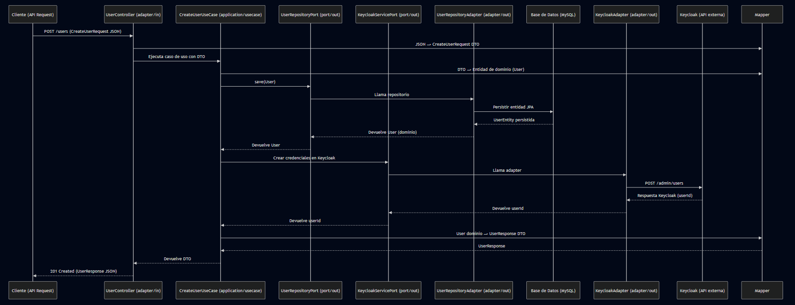

# 📘 Documentación Técnica – User Service

## 🎯 Objetivo
Este microservicio gestiona los **usuarios de negocio** (perfil, teléfono, email, etc.) y se integra con **Keycloak** para la gestión de credenciales y roles.  
Se diseñó siguiendo el patrón **Arquitectura Hexagonal (Ports & Adapters)** para mantener el dominio desacoplado de la infraestructura técnica.

---

## 🏗️ Estructura de Carpetas

### 📂 `application/`
Define **qué hace la aplicación**. Aquí viven los **casos de uso**, los **puertos** y los **DTOs**.

- **dto/**  
  Objetos de transferencia de datos entre capas.  
  Se utilizan para llevar información entre capas sin exponer directamente las entidades del dominio.

- **port/**  
  Interfaces que actúan como contratos entre la aplicación y la infraestructura.
    - **in/** → Operaciones que se pueden invocar desde fuera del sistema (ej. crear, buscar o listar usuarios).
    - **out/** → Dependencias externas que la aplicación necesita (ej. guardar en la base de datos, crear en Keycloak).

- **usecase/**  
  Implementaciones de los **casos de uso**.
    - Contienen la lógica de orquestación.
    - Invocan al dominio para aplicar reglas de negocio.
    - Usan los puertos de salida para acceder a DB o Keycloak.

---

### 📂 `domain/`
Representa el **núcleo del negocio**.  
Define los **modelos** y las **reglas de negocio puras**.

- **model/**  
  Entidades centrales del dominio (ej. Usuario).  
  Contienen atributos y posibles validaciones de negocio.

- **service/**  
  Servicios de dominio que encapsulan reglas complejas, independientes de frameworks o infraestructura.

⚠️ Esta capa no depende de nada externo: ni Spring, ni JPA, ni Keycloak.

---

### 📂 `infrastructure/`
Implementa los **detalles técnicos** que permiten que la aplicación funcione.

- **adapter/**  
  Implementaciones concretas de los puertos.
    - **in/** → Adaptadores de entrada (ejemplo: controladores HTTP que reciben peticiones REST).
    - **out/** → Adaptadores de salida (ejemplo: conector a Keycloak, repositorio que habla con la base de datos).

- **config/**  
  Configuración de librerías y frameworks.  
  Incluye seguridad, integración con Keycloak, mapeadores, documentación Swagger/OpenAPI, etc.

- **mapper/**  
  Conversores entre objetos de dominio, DTOs y entidades de persistencia.  
  Utiliza MapStruct para generar implementaciones automáticas.

- **persistence/**  
  Todo lo relacionado con la base de datos.
    - **entity/** → Entidades JPA que reflejan tablas de la base.
    - **repository/** → Repositorios Spring Data JPA.
    - **adapter/** → Implementación del puerto de persistencia, traduce entre el dominio y JPA.

---

## 🔄 Flujo de Ejecución (Ejemplo: Crear Usuario)

1. El **cliente** hace un `POST /users`.
2. La petición llega al **Controller** (adapter/in).
3. El Controller transforma el JSON en un **DTO** y lo envía al **caso de uso** correspondiente.
4. El **Caso de Uso** (application/usecase) crea una entidad de dominio y ejecuta reglas de negocio.
5. El Caso de Uso usa dos **puertos de salida**:
    - Repositorio → Guardar datos de negocio en la **base de datos**.
    - Servicio externo → Crear credenciales en **Keycloak**.
6. Los **adapters de salida** implementan esos puertos:
    - El repositorio usa JPA para persistir.
    - El conector a Keycloak consume la API de administración de Keycloak.
7. El Caso de Uso recibe las respuestas y construye un **DTO de salida**.
8. El Controller devuelve la respuesta al **cliente** como JSON.

---

## 📖 Diagrama en Flujo

---

## ✅ Beneficios
- **Desacoplamiento total** entre dominio y tecnología.
- **Sustituibilidad**: se puede cambiar DB o proveedor de autenticación sin tocar los casos de uso.
- **Testabilidad**: los casos de uso se pueden probar con mocks de los puertos.
- **Escalabilidad**: se pueden agregar nuevos adapters de entrada (ej. gRPC, mensajería) sin modificar el dominio.

---

## 🌐 Endpoints Principales

- `POST /users` → Crear un nuevo usuario (Keycloak + BD).
- `GET /users` → Listar todos los usuarios.
- `GET /users/{id}` → Obtener usuario por ID.
- `GET /users/me` → Obtener el perfil del usuario autenticado (desde el JWT).
- `PUT /users/{id}` → Actualizar datos de un usuario.
- `PATCH /users/{id}/status` → Actualizar estado (ACTIVO/INACTIVO).
- `DELETE /users/{id}` → Eliminar un usuario (Keycloak + BD).
- `PUT /users/{id}/password` → Cambiar contraseña en Keycloak.
- `POST /users/{id}/reset-password` → Enviar email de reseteo de contraseña vía Keycloak.

---

## 🛠️ Tecnologías Utilizadas

- **Java 21**
- **Spring Boot 3.3.x**
- **Spring Data JPA** con **MySQL**
- **Spring Security** (OAuth2 Resource Server)
- **Keycloak Admin Client** para integración de usuarios y roles
- **MapStruct** para mapeo entre entidades/DTOs
- **Lombok** para reducir boilerplate
- **Swagger / OpenAPI** para documentación de endpoints
- **Logback** para logging avanzado
    - Logs en consola, archivo plano y archivo JSON
    - MDC con `traceId` para trazabilidad de requests
    - Filtro global para registrar cada request (método, URI, usuario autenticado, status y duración)

---

## 🔐 Integración con Keycloak

- Creación de usuarios con credenciales en **Keycloak** al registrarlos en el sistema.
- Sincronización de datos clave (email, estado, perfil).
- Eliminación de usuarios tanto en BD local como en Keycloak.
- Reseteo y actualización de contraseñas mediante la API de administración de Keycloak.
- Gestión de roles a través de Keycloak.

---

## 📝 Logging

Se implementó un sistema de logging completo para:
- **Controllers**: entrada y salida de requests.
- **Casos de uso**: trazabilidad de operaciones críticas (crear, actualizar, eliminar).
- **Adapters externos**: integración con Keycloak y base de datos.
- **Excepciones globales**: manejo centralizado de errores.
- **Filtros HTTP**: registro de cada request entrante con usuario autenticado, status y duración.
- **MDC (Mapped Diagnostic Context)**: se genera un `traceId` único por request para correlacionar logs en sistemas de observabilidad (Grafana/ELK).

Logs disponibles en:
- **Consola (texto plano)**
- **Archivo plano rotativo** (`logs/user-service.log`)
- **Archivo JSON** (`logs/user-service-json.log`)  

## 🧪 Tests Unitarios

El microservicio cuenta con **tests unitarios implementados con JUnit 5 y Mockito**, cubriendo los principales **casos de uso de la capa `application/usecase`**.  
Los tests validan tanto escenarios exitosos como excepciones, asegurando la **robustez** de la lógica de negocio y la correcta interacción con Keycloak y la base de datos.

### Cobertura actual

- **Creación de usuario**
    - Caso válido → guarda en BD y en Keycloak
    - Email o contraseña faltante → lanza excepción

- **Actualización de usuario**
    - Usuario inexistente → lanza `ResourceNotFoundException`
    - Email duplicado → lanza `EmailAlreadyInUseException`
    - Caso válido → persiste cambios y sincroniza con Keycloak

- **Eliminación de usuario**
    - Usuario inexistente → lanza `ResourceNotFoundException`
    - Caso válido → elimina en BD y en Keycloak

- **Consulta de usuario por ID**
    - Usuario inexistente → excepción
    - Caso válido → devuelve `UserResponse`

- **Consulta del usuario autenticado**
    - KeycloakId inexistente → excepción
    - KeycloakId válido → devuelve `UserResponse`

- **Listado de usuarios**
    - Lista vacía → devuelve lista vacía
    - Lista con usuarios → devuelve lista de `UserResponse`

- **Cambio de contraseña**
    - Usuario inexistente → excepción
    - Caso válido → invoca a Keycloak para actualizar contraseña

- **Reseteo de contraseña**
    - ID inválido → lanza `IllegalArgumentException`
    - Usuario inexistente → lanza `ResourceNotFoundException`
    - Caso válido → envía email de reseteo vía Keycloak

- **Actualización de estado**
    - Usuario inexistente → excepción
    - Caso válido → actualiza estado en BD y en Keycloak

### Beneficios de los tests
- Verificación de **reglas de negocio** críticas.
- Asegura la correcta **orquestación de casos de uso**.
- Permite hacer **refactors con seguridad** gracias a los mocks.
- Ejecución rápida y aislada, sin necesidad de levantar Keycloak ni la base de datos.  
