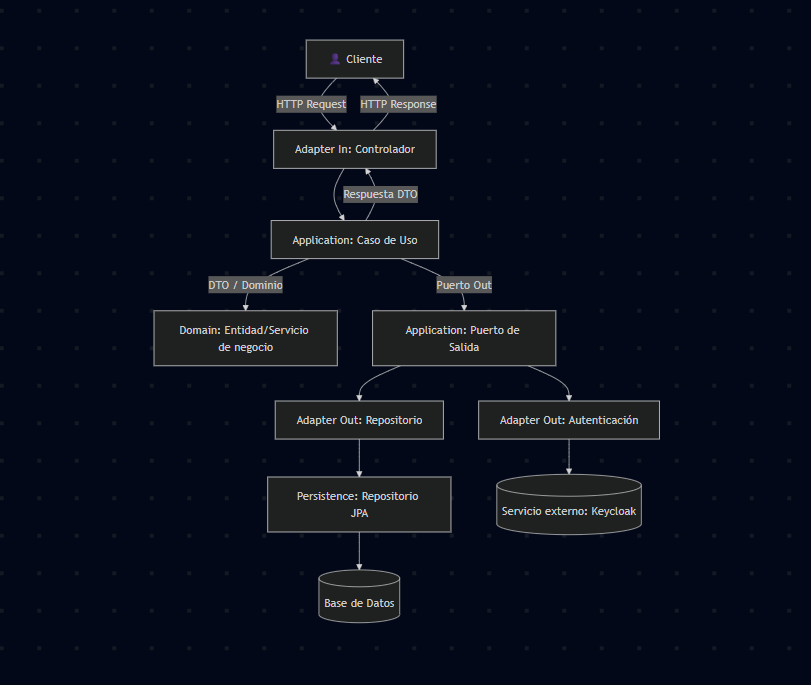

# 📘 Guía de Arquitectura Hexagonal (Ports & Adapters)

## 🎯 Objetivo
La arquitectura hexagonal (también conocida como **Ports & Adapters**) se utiliza para **separar la lógica de negocio del resto de la infraestructura técnica**.  
De esta forma:
- El **dominio** permanece limpio, sin depender de frameworks ni de detalles externos.
- La **aplicación** define los casos de uso de manera clara.
- La **infraestructura** se encarga de los detalles técnicos como HTTP, bases de datos o servicios externos.

Esto permite que el sistema sea **fácil de mantener, probar y extender**, ya que cambiar una tecnología (ej. pasar de MySQL a MongoDB) no afecta al núcleo de negocio.

---

## 🏗️ Capas principales

### 1. **Application**
La capa de **aplicación** define **qué hace el sistema** (los casos de uso).  
Aquí no importa cómo se guardan los datos ni cómo se reciben las peticiones, solo importa la lógica de orquestación.

- **dto/**  
  Contiene objetos de transferencia de datos.  
  Se utilizan para llevar información entre capas sin exponer directamente las entidades del dominio.

- **port/**  
  Define interfaces (puertos) que separan la aplicación de la infraestructura.
    - **in/**: Qué operaciones externas pueden invocar los casos de uso (entrada al sistema).
    - **out/**: Qué dependencias externas necesita la aplicación (salida del sistema).

- **usecase/**  
  Implementa los **casos de uso del negocio**.  
  Cada caso de uso orquesta el flujo: recibe datos, interactúa con el dominio y utiliza puertos de salida para acceder a infraestructura.

---

### 2. **Domain**
La capa de **dominio** representa el **corazón del negocio**.  
Aquí se define la lógica más pura y las reglas que no cambian aunque se reemplacen tecnologías.

- **model/**  
  Contiene las entidades del negocio. Estas entidades representan conceptos centrales (ej. un usuario, un cliente, un producto).

- **service/**  
  Servicios de dominio que encapsulan reglas de negocio más complejas que no pertenecen a una sola entidad.  
  Ejemplo: validaciones, cálculos, reglas de negocio.

⚠️ El dominio **no depende de nada externo** (ni HTTP, ni bases de datos, ni frameworks).

---

### 3. **Infrastructure**
La capa de **infraestructura** se encarga de los **detalles técnicos** que permiten que la aplicación funcione en el mundo real.  
Aquí se implementan las interfaces definidas en los puertos de la aplicación.

- **adapter/**  
  Implementaciones concretas de los puertos.
    - **in/**: Adapters de entrada (ejemplo: controladores HTTP que reciben peticiones).
    - **out/**: Adapters de salida (ejemplo: repositorios que hablan con la base de datos, o conectores a servicios externos).

- **config/**  
  Configuraciones de frameworks y librerías (seguridad, mapeadores, documentación, etc.).

- **mapper/**  
  Conversores entre modelos de dominio y modelos de infraestructura (ej. entre entidad de dominio y entidad JPA).

- **persistence/**  
  Todo lo relacionado con la base de datos.
    - **entity/**: Entidades de persistencia (normalmente JPA).
    - **repository/**: Repositorios propios del framework (ej. Spring Data JPA).
    - **adapter/**: Implementaciones que traducen entre el dominio y la base de datos utilizando los repositorios.

---

## 🔄 Flujo típico de una operación
1. Una petición entra al sistema por un **adapter de entrada** (ej. un controlador HTTP).
2. El controlador invoca un **caso de uso** de la aplicación.
3. El caso de uso ejecuta la lógica de negocio, apoyándose en las entidades del **dominio**.
4. Si necesita guardar o consultar datos, llama a un **puerto de salida**.
5. Un **adapter de salida** implementa ese puerto y habla con la infraestructura real (ej. base de datos, Keycloak, API externa).
6. La respuesta regresa por el mismo camino hacia el cliente.

---

## ✅ Beneficios
- **Desacoplamiento**: el negocio no depende de frameworks.
- **Testabilidad**: se pueden probar los casos de uso con puertos simulados (mocks).
- **Flexibilidad**: cambiar tecnologías externas no afecta al dominio ni a la aplicación.
- **Escalabilidad**: es más sencillo extender el sistema con nuevos adapters o servicios.  
 
- 