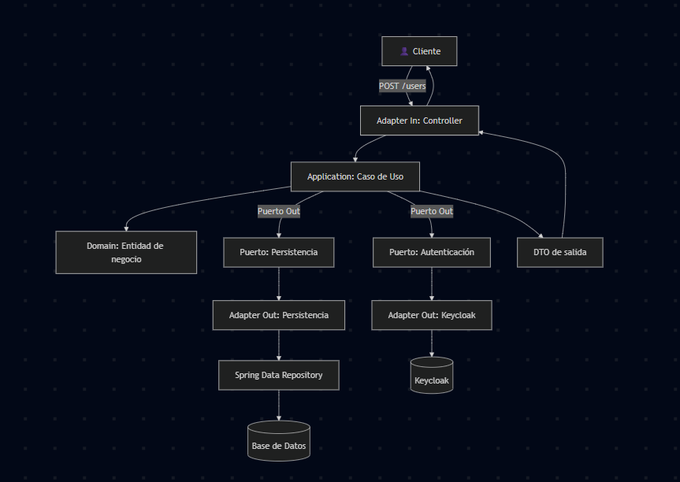

# 📘 Documentación Arquitectónica – User Service

## 🎯 Objetivo
Este microservicio gestiona los **usuarios de negocio** (perfil, teléfono, email, etc.) y se integra con **Keycloak** para la gestión de credenciales y roles.  
Se diseñó siguiendo el patrón **Arquitectura Hexagonal (Ports & Adapters)** para mantener el dominio desacoplado de la infraestructura técnica.

---

## 🏗️ Estructura de Carpetas

### 📂 `application/`
Define **qué hace la aplicación**. Aquí viven los **casos de uso**, los **puertos** y los **DTOs**.

- **dto/**  
  Objetos de transferencia de datos entre capas.  
  Se utilizan para llevar información entre capas sin exponer directamente las entidades del dominio.

- **port/**  
  Interfaces que actúan como contratos entre la aplicación y la infraestructura.  
  - **in/** → Operaciones que se pueden invocar desde fuera del sistema (ej. crear, buscar o listar usuarios).  
  - **out/** → Dependencias externas que la aplicación necesita (ej. guardar en la base de datos, crear en Keycloak).

- **usecase/**  
  Implementaciones de los **casos de uso**.  
  - Contienen la lógica de orquestación.  
  - Invocan al dominio para aplicar reglas de negocio.  
  - Usan los puertos de salida para acceder a DB o Keycloak.  

---

### 📂 `domain/`
Representa el **núcleo del negocio**.  
Define los **modelos** y las **reglas de negocio puras**.

- **model/**  
  Entidades centrales del dominio (ej. Usuario).  
  Contienen atributos y posibles validaciones de negocio.

- **service/**  
  Servicios de dominio que encapsulan reglas complejas, independientes de frameworks o infraestructura.  

⚠️ Esta capa no depende de nada externo: ni Spring, ni JPA, ni Keycloak.

---

### 📂 `infrastructure/`
Implementa los **detalles técnicos** que permiten que la aplicación funcione.

- **adapter/**  
  Implementaciones concretas de los puertos.  
  - **in/** → Adaptadores de entrada (ejemplo: controladores HTTP que reciben peticiones REST).  
  - **out/** → Adaptadores de salida (ejemplo: conector a Keycloak, repositorio que habla con la base de datos).  

- **config/**  
  Configuración de librerías y frameworks.  
  Incluye seguridad, integración con Keycloak, mapeadores, documentación Swagger/OpenAPI, etc.

- **mapper/**  
  Conversores entre objetos de dominio, DTOs y entidades de persistencia.  
  Utiliza MapStruct para generar implementaciones automáticas.

- **persistence/**  
  Todo lo relacionado con la base de datos.  
  - **entity/** → Entidades JPA que reflejan tablas de la base.  
  - **repository/** → Repositorios Spring Data JPA.  
  - **adapter/** → Implementación del puerto de persistencia, traduce entre el dominio y JPA.

---

## 🔄 Flujo de Ejecución (Ejemplo: Crear Usuario)

1. El **cliente** hace un `POST /users`.  
2. La petición llega al **Controller** (adapter/in).  
3. El Controller transforma el JSON en un **DTO** y lo envía al **caso de uso** correspondiente.  
4. El **Caso de Uso** (application/usecase) crea una entidad de dominio y ejecuta reglas de negocio.  
5. El Caso de Uso usa dos **puertos de salida**:
   - Repositorio → Guardar datos de negocio en la **base de datos**.  
   - Servicio externo → Crear credenciales en **Keycloak**.  
6. Los **adapters de salida** implementan esos puertos:  
   - El repositorio usa JPA para persistir.  
   - El conector a Keycloak consume la API de administración de Keycloak.  
7. El Caso de Uso recibe las respuestas y construye un **DTO de salida**.  
8. El Controller devuelve la respuesta al **cliente** como JSON.

---

## 📖 Diagrama en Flujo

---

## ✅ Beneficios
- **Desacoplamiento total** entre dominio y tecnología.  
- **Sustituibilidad**: se puede cambiar DB o proveedor de autenticación sin tocar los casos de uso.  
- **Testabilidad**: los casos de uso se pueden probar con mocks de los puertos.  
- **Escalabilidad**: se pueden agregar nuevos adapters de entrada (ej. gRPC, mensajería) sin modificar el dominio.  
